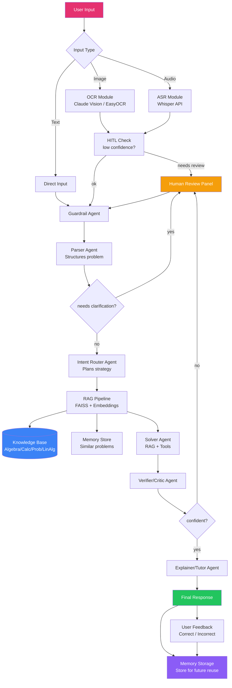

# 🧮 Math Mentor — Multimodal JEE Math Problem Solver

> **RAG + Multi-Agent + HITL + Memory** — An end-to-end AI application for reliably solving JEE-style math problems

[](https://www.python.org/)
[](https://streamlit.io/)
[](https://anthropic.com/)

---

## 📋 Table of Contents

- [Architecture Overview](#architecture-overview)
- [Features](#features)
- [Setup & Installation](#setup--installation)
- [Running Locally](#running-locally)
- [Deployed App](#deployed-app)
- [Agent System](#agent-system)
- [Knowledge Base](#knowledge-base)
- [HITL Workflow](#hitl-workflow)
- [Memory & Self-Learning](#memory--self-learning)

---

## Architecture Overview



---

## Features

### Multimodal Input
| Mode | Technology | OCR/ASR Confidence |
|------|-----------|-------------------|
| **Image** | Claude Vision (primary) + EasyOCR + Tesseract | ✅ Shown to user |
| **Audio** | OpenAI Whisper API + local Whisper | ✅ Shown to user |
| **Text** | Direct input with example prompts | ✅ Always high |

### Agent System (6 Agents)
1. **Guardrail Agent** — Validates input scope and safety
2. **Parser Agent** — Converts raw input → structured JSON problem
3. **Intent Router Agent** — Classifies topic, plans solution strategy
4. **Solver Agent** — Solves using RAG context + symbolic tools
5. **Verifier/Critic Agent** — Checks correctness, domain constraints, edge cases
6. **Explainer/Tutor Agent** — Generates pedagogical step-by-step explanation

### RAG Pipeline
- Knowledge base: 5 curated documents (algebra, probability, calculus, linear algebra, templates)
- Chunking with overlap (500 word chunks, 50 word overlap)
- Semantic search with `sentence-transformers` + FAISS
- Fallback keyword search when embeddings unavailable
- Top-K retrieval with source display in UI

### Human-in-the-Loop (HITL)
Triggers when:
- OCR/ASR confidence < 60%
- Parser detects ambiguous/incomplete problem
- Verifier agent uncertainty > threshold
- User explicitly requests re-check

HITL Panel allows:
- Approve / Edit+Approve / Reject solution
- Edit parsed problem text
- All outcomes stored as learning signals

### Memory & Self-Learning
- JSON-based persistent store (`memory/math_memory.json`)
- Finds similar solved problems at inference time
- Reuses correct solution patterns
- Stores correction rules from user feedback
- Topic-level accuracy tracking
- Session counter

---

## Setup & Installation

### Prerequisites
- Python 3.10+
- Anthropic API key (required)
- OpenAI API key (optional, for Whisper)

### Installation

```bash
# Clone the repository
git clone https://github.com/yourusername/math-mentor.git
cd math-mentor

# Create virtual environment
python -m venv venv
source venv/bin/activate  # On Windows: venv\Scripts\activate

# Install dependencies
pip install -r requirements.txt

# Install Tesseract (optional, for fallback OCR)
# Ubuntu/Debian:
sudo apt-get install tesseract-ocr
# macOS:
brew install tesseract
# Windows: Download from https://github.com/UB-Mannheim/tesseract/wiki

# Set up environment variables
cp .env.example .env
# Edit .env and add your ANTHROPIC_API_KEY
```

---

## Running Locally

```bash
# Make sure you're in the project directory with venv activated
streamlit run app.py

# The app will open at http://localhost:8501
```

### Quick Test

```bash
# Run a quick functionality test
python -c "
from agents.orchestrator import MathMentorOrchestrator
from rag.pipeline import MathRAGPipeline
from memory.store import MathMemory
import os
os.environ['ANTHROPIC_API_KEY'] = 'your-key-here'

rag = MathRAGPipeline(knowledge_base_path='./knowledge_base')
rag.build_index()
mem = MathMemory()
orch = MathMentorOrchestrator(rag, mem)
result = orch.process('Solve: x^2 - 5x + 6 = 0')
print('Answer:', result['answer'])
print('Success:', result['success'])
"
```

---

## Deployed App

🔗 **Live App**: [https://aiplanet-assignment-harsh-joshi.streamlit.app/](Link)


### Parser Agent
```json
{
  "problem_text": "Find the roots of 2x² - 7x + 3 = 0",
  "topic": "algebra",
  "subtopic": "quadratic_equations",
  "variables": ["x"],
  "constraints": [],
  "given_values": {"a": 2, "b": -7, "c": 3},
  "what_to_find": "roots of the quadratic",
  "problem_type": "equation",
  "difficulty": "easy",
  "needs_clarification": false,
  "confidence": 0.97
}
```

### Verifier Output
```json
{
  "is_correct": true,
  "confidence": 0.92,
  "issues_found": [],
  "domain_check": "passed",
  "unit_check": "not_applicable",
  "edge_case_check": "passed",
  "trigger_hitl": false
}
```

---

## Knowledge Base

| Document | Content | Chunks |
|----------|---------|--------|
| `algebra.md` | Quadratics, factoring, AM-GM, logarithms, binomial theorem | ~8 |
| `probability.md` | Basic probability, Bayes, distributions, combinatorics | ~7 |
| `calculus.md` | Limits, derivatives, optimization, MVT | ~9 |
| `linear_algebra.md` | Matrices, determinants, inverse, vectors, eigenvalues | ~8 |
| `solution_templates.md` | Problem-solving templates for each topic | ~6 |
| `common_mistakes.md` | Common pitfalls by topic | ~5 |

---

## HITL Workflow

```
OCR/ASR Result (low confidence)
         ↓
   HITL Panel Opens
         ↓
Human Reviews Extracted Text → [Edit] → Continue
         ↓
Parser Detects Ambiguity
         ↓
   HITL Panel Opens
         ↓
Human Clarifies Problem → Continue
         ↓
Verifier Unsure (confidence < 0.6)
         ↓
   HITL Panel Opens
         ↓
Human Approves/Edits/Rejects → Store as Learning Signal
```

---

## Memory & Self-Learning

The memory system uses a JSON store that persists between sessions:

```json
{
  "solved_problems": [
    {
      "id": "abc123",
      "timestamp": "2024-01-15T10:30:00",
      "topic": "algebra",
      "parsed_problem": {...},
      "solution": "...",
      "user_feedback": "correct",
      "confidence": 0.92
    }
  ],
  "correction_rules": [
    {
      "topic": "probability",
      "correction": "Don't forget to subtract P(A∩B) in the addition rule"
    }
  ],
  "topic_stats": {
    "algebra": {"solved": 5, "correct": 4, "incorrect": 1}
  }
}
```

**At runtime**, memory is used to:
1. Find similar previously solved problems (keyword similarity)
2. Pass them as context to the Solver Agent
3. Apply stored correction rules for the topic
4. Show "memory reuse" indicator in the UI

---

## Scope of Math Topics

| Topic | Coverage |
|-------|---------|
| **Algebra** | Quadratic equations, factoring, inequalities, sequences, logarithms, binomial theorem |
| **Probability** | Basic probability, combinatorics, Bayes' theorem, distributions |
| **Calculus** | Limits, derivatives (all rules), optimization, MVT, Rolle's theorem |
| **Linear Algebra** | Matrices, determinants, inverse, systems of equations, vectors, eigenvalues |

---
